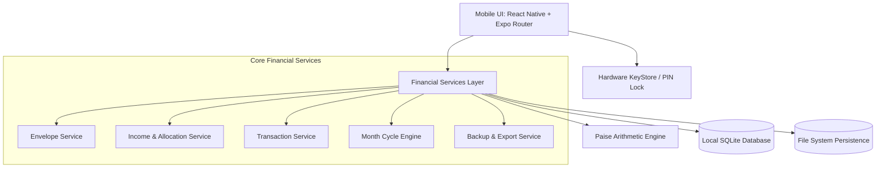

# ✉️ Envelope Budget

> **A high-performance, 100% offline, privacy-first personal finance application for Android built with React Native, Expo, and SQLite.**

[](https://reactnative.dev/)
[](https://expo.dev/)
[](https://www.typescriptlang.org/)
[](https://www.sqlite.org/)
[](https://android.com)
[](#privacy--offline-guarantee)
[](#testing--verification)
[](LICENSE)

---

## 📖 Overview

**Envelope Budget** brings the classic, disciplined **Envelope Budgeting Method** into a modern, tactile mobile experience. Every rupee earned is given a specific purpose before it is spent—eliminating impulse spending and providing absolute clarity over where your money goes.

Unlike modern financial applications that demand bank logins, cloud sync, or display ads, **Envelope Budget is engineered to be 100% offline and autonomous**. Your financial records never leave your physical device.

---

## ✨ Key Features

### ✉️ Digital Envelope Allocation
- **Zero-Sum Budgeting**: Allocate your net income across custom envelopes (e.g., *Groceries, Rent, Fuel, Entertainment, Emergency Fund*).
- **Live Allocation Tracking**: Real-time balance calculations showing exactly how much unallocated money remains.
- **Envelope Transfers**: Shift funds between envelopes seamlessly whenever real-world priorities change.

### 🔢 Exact Mathematical Precision (Paise Engine)
- **Zero Floating-Point Drift**: All monetary values are strictly computed and stored as **integer paise** (e.g., `₹500.50` = `50050` paise).
- Eliminates standard IEEE-754 binary floating-point rounding errors common in financial apps.
- Native Indian number formatting with rupee symbol (`₹`) display.

### 🔄 Intelligent Monthly Cycle Engine
- **Automated Rollover**: On the 1st of each month, the system detects cycle boundaries and initializes the new month.
- **Configurable Carry-Over**: Toggle whether positive balances roll over into the next month or reset per envelope.
- **Recurring Income Deduplication**: Automatically records scheduled salary/income for the new cycle without duplicate payouts.

### 📊 Visual Spending Insights
- **Color-Coded Status**: Real-time spending health indicators:
  - 🟢 **Safe**: < 70% budget consumed
  - 🟡 **Caution**: 70% – 90% budget consumed
  - 🔴 **Overspent**: > 100% budget consumed (with explicit overspend warnings)
- **Interactive Visualizations**: SVG donut breakdown of category expenditures.
- **Transaction History**: Filter and search by month, envelope, and transaction type.

### 🛡️ Security & Complete Data Autonomy
- **App PIN Lock**: Secure sensitive financial details behind a 4-digit master PIN stored in native hardware storage (`expo-secure-store`).
- **Encrypted Local Storage**: SQLite database running locally on your device with automatic disk synchronization.
- **Portability**: One-tap full JSON backup export & restore, plus CSV transaction exports compatible with Excel and Google Sheets.
- **Zero Network Permissions Required**: No trackers, no telemetry, no analytics, no external servers.

---

## 🏛️ System Architecture



### Database Schema (Local SQLite)

| Table | Purpose | Key Attributes |
| :--- | :--- | :--- |
| `envelopes` | Budget categories & allocations | `id`, `name`, `budget_paise`, `color`, `icon`, `carry_over` |
| `incomes` | Inflow entries & paychecks | `id`, `amount_paise`, `source`, `date`, `is_recurring`, `month_key` |
| `transactions` | Expenses & balance deductions | `id`, `envelope_id`, `amount_paise`, `description`, `date`, `month_key` |
| `envelope_transfers` | Inter-envelope reallocations | `id`, `from_envelope_id`, `to_envelope_id`, `amount_paise`, `date` |
| `month_cycles` | Monthly rollover snapshots | `month_key`, `is_closed`, `started_at`, `closed_at` |
| `app_settings` | App preferences & security states | `key`, `value` |

---

## 📁 Repository Structure

```text
envelope-budget/
├── android/                   # Native Android Gradle configuration & build files
├── app/                       # Expo Router application screens & navigation
│   ├── (tabs)/                # Main bottom tab bar navigation
│   │   ├── index.tsx          # Dashboard (Envelopes, Donut Chart, Balances)
│   │   ├── budgets.tsx        # Budget planning & allocation screen
│   │   ├── transactions.tsx   # Transaction history & search
│   │   └── more.tsx           # Settings, Backup/Restore, Security PIN
│   ├── envelope/              # Envelope management (Add, Edit, Detail, Transfer)
│   ├── expense/               # Expense entry forms
│   ├── income/                # Income logging & allocation flows
│   ├── insights/              # Monthly analytics & breakdown
│   ├── modal/                 # Quick actions popup modal
│   └── _layout.tsx            # Root layout, theme provider, and PIN guard
├── assets/                    # App icons, splash screens, and adaptive vectors
├── components/                # Reusable UI components (Cards, Modals, Donut Chart)
├── database/                  # SQLite database connection, schemas, and seeders
├── services/                  # Core business logic & financial calculation modules
├── tests/                     # Unit & integration tests for financial engine
├── utils/                     # Currency, date, and icon helper utilities
├── app.json                   # Expo application manifest
├── package.json               # Dependencies and scripts
└── tsconfig.json              # TypeScript configuration
```

---

## 🚀 Getting Started

### Prerequisites

Ensure you have the following installed on your machine:
- **Node.js**: `v18.x` or `v20.x` LTS
- **npm** or **yarn**
- **Git**

### Installation

1. Clone this repository:
   ```bash
   git clone https://github.com/your-username/envelope-budget.git
   cd envelope-budget
   ```

2. Install dependencies:
   ```bash
   npm install
   ```

3. Launch the development server:
   ```bash
   npx expo start
   ```

You can now test the app via the **Expo Go** client, an Android Emulator, or open the web preview with `w`.

---

## 🤖 Building the Native Android APK

The project is configured for standalone native Android builds via Gradle.

### 1. Prerequisites for Native Android Build
- **Java Development Kit**: OpenJDK 17 (`JAVA_HOME=/usr/lib/jvm/java-17-openjdk-amd64`)
- **Android SDK**: Android SDK Platform 34 & Build-Tools 34.0.0 (`ANDROID_HOME=~/Android/Sdk`)

Ensure environment variables are set in your terminal:
```bash
export JAVA_HOME=/usr/lib/jvm/java-17-openjdk-amd64
export ANDROID_HOME=$HOME/Android/Sdk
export PATH=$JAVA_HOME/bin:$ANDROID_HOME/cmdline-tools/latest/bin:$ANDROID_HOME/platform-tools:$PATH
```

### 2. Generate the Native Project (if rebuilding from scratch)
```bash
npx expo prebuild --platform android
```

### 3. Assemble Release APK
```bash
cd android
./gradlew assembleRelease
```

The compiled, production-ready APK will be created at:
```text
android/app/build/outputs/apk/release/app-release.apk
```

### 4. Install onto Android Device

With USB Debugging enabled:
```bash
adb install -r android/app/build/outputs/apk/release/app-release.apk
```

Or assemble a debug build for quick development:
```bash
./gradlew assembleDebug
```

---

## 🧪 Testing & Verification

The core financial math engine, rollover mechanics, and data integrity modules are covered by automated unit tests.

Run the test suite:
```bash
npm test
```

### Test Coverage Highlights
- ✅ **Paise Arithmetic**: Validates integer formatting, parsing, and zero rounding errors.
- ✅ **Envelope Deductions & Balance Recovery**: Verifies balance updates and deletion restorations.
- ✅ **Overspending Tolerance**: Allows negative balance states without data corruption.
- ✅ **Transfers**: Ensures atomic source/destination balance movements.
- ✅ **Monthly Rollovers**: Verifies carry-over logic and monthly cycle rollover transitions.
- ✅ **Recurring Income Deduplication**: Prevents duplicate income allocations in new months.
- ✅ **Backup & Restore**: Verifies full database state serialization and deserialization.

Type checking:
```bash
npx tsc --noEmit
```

---

## 🔒 Privacy & Offline Guarantee

Envelope Budget operates under strict privacy principles:
- **Zero Third-Party SDKs**: No Facebook, Google Firebase, or analytics beacons.
- **Zero Network Calls**: Works flawlessly in Airplane Mode.
- **Local Persistence**: All data is stored in the app's sandboxed storage directory.
- **Full Data Export**: You can export your data to an unencrypted JSON or standard CSV at any time.

---

## 🤝 Contributing

Contributions are welcome! Please feel free to submit a Pull Request.

1. Fork the Project
2. Create your Feature Branch (`git checkout -b feature/AmazingFeature`)
3. Commit your Changes (`git commit -m 'Add some AmazingFeature'`)
4. Push to the Branch (`git push origin feature/AmazingFeature`)
5. Open a Pull Request

---

## 📄 License

This project is licensed under the MIT License - see the [LICENSE](LICENSE) file for details.
